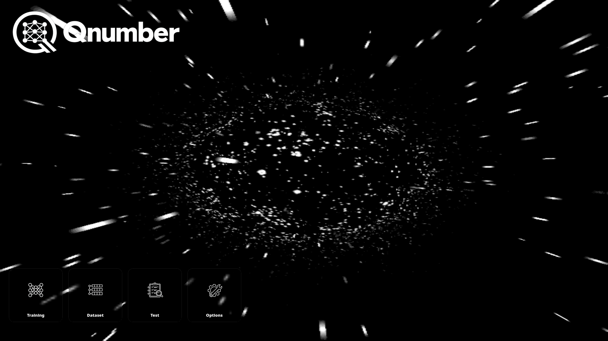

# Qnumber



Qnumber is a desktop machine learning laboratory built with Python and PyQt6.  
It is designed for controlled neural network experimentation using 32×32 digit datasets.

This project focuses on understanding how architecture, parameters, and dataset quality directly affect model behavior.

---

## Overview

Qnumber is not a wrapper over large ML frameworks.  
It is a structured educational environment where every component is transparent and controllable.

The application allows:

- Managing structured digit datasets (train / test)
- Sorting and inspecting images
- Safe bulk deletion with confirmation
- Controlled neural network configuration
- Visual experimentation with model behavior

The goal is clarity over abstraction.

---

## Dataset Architecture

The dataset follows a deterministic structure:
dataset/
train/
0/
1/
...
9/
test/
0/
1/
...
9/


Training images format:
digit_index.png
Example:
0_00000.png
1_00042.png

## Technical Stack

- Python 3.11+
- PyQt6
- NumPy
- Pillow

The UI is built with a modular architecture:
ui/
engine/
storage/
assets/

Each module has a strict responsibility.

---

## Installation

Clone the repository:

```bash
git clone https://github.com/milord-x/Qnumber.git
cd Qnumber

Create virtual environment (Fish shell):
python -m venv .venv
source .venv/bin/activate.fish
pip install -r requirements.txt
```
Run:
```
python app.py
```
---

## Design Philosophy

Qnumber is built on three principles:

Deterministic structure

Minimal abstraction

Full experimental control

Neural networks should be observed, not mystified.

## Project Status

Current version includes:

Fully implemented Dataset screen

Sorting (Asc / Desc)

Delete-all with train/test selection

Stable background rendering

OLED-style UI refinement

Next stages include:

Draw module

Generate module

Real-time visualization
